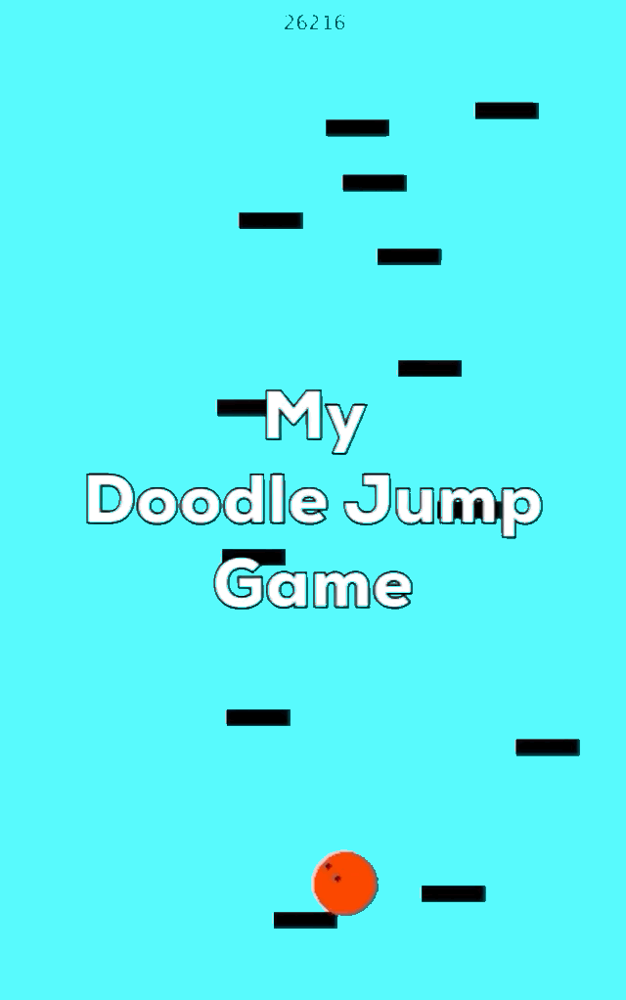

# Doodle-Jump
Old Doodle Jump Project that I made in late 2013.



# Run / Test / Play App
The executable jar is in `out/artifacts/Doodle_Jump_jar/Doodle-Jump.jar`. Just run on the command line  
```bash
java -cp out/artifacts/Doodle_Jump_jar/Doodle-Jump.jar DoodleJump.App`
```

## Note About Library Dependencies
This game relies on library `gfx` that I created. I have included its source code under `src/main/java/gfx` just to make it accessible. The directory structure is like Maven's just for organization. Maven was not used to create this game. I also included the jar for `gfx` in `src/lib` in addition to dependency jar `cs015.jar`. I did not write code for that, so its source code is not included. 